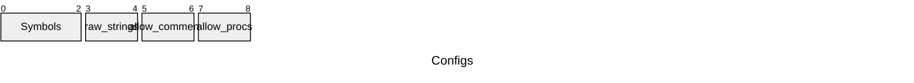

## Memory Layout

### Layout encoding

## Binary serialization

Except for a small header, the binary serialization of a tree is identical to its representation in memory.

### Header format


An array of sections follows. The definition of a section depends on the data types of the build:
```c++
struct __attribute__ ((packed)) section_t{
    struct __attribute__ ((packed)){
        delta_ptr_t  base;      //Aligned to the beginning of the symbols table.
        xml_count_t  length;    //Aligned to base
    } name;
    delta_ptr_t     base;      //Aligned to start_data() (after symbols)
    xml_count_t     length;    //Relative to base
}
```



### Multi-doc archives

TBW.

## Indices

TBW.